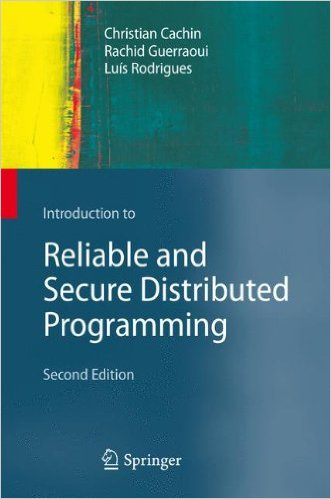

# rsdp

**This code is alpha status. The current implementations are not necessarily functional or correct.**

Implementations of algorithms from [*Introduction to Reliable and Secure Distributed Programming*][rsdp].

[rsdp]: http://distributedprogramming.net

## List of Algorithms

### Chapter 1: Introduction

- [1.1 Synchronous Job Handler](https://github.com/rads/rsdp/blob/master/src/rads/rsdp/algorithms/synchronous_job_handler.clj)
- [1.2 Asynchronous Job Handler](https://github.com/rads/rsdp/blob/master/src/rads/rsdp/algorithms/asynchronous_job_handler.clj)
- [1.3 Job-Transformation by Buffering](https://github.com/rads/rsdp/blob/master/src/rads/rsdp/algorithms/job_transformation_by_buffering.clj)

### Chapter 2: Basic Abstractions

- [2.1 Retransmit Forever](https://github.com/rads/rsdp/blob/master/src/rads/rsdp/algorithms/retransmit_forever.clj)
- [2.2 Eliminate Duplicates](https://github.com/rads/rsdp/blob/master/src/rads/rsdp/algorithms/eliminate_duplicates.clj)
- [2.3 Log Delivered](https://github.com/rads/rsdp/blob/master/src/rads/rsdp/algorithms/log_delivered.clj)
- [2.4 Authenticate and Filter](https://github.com/rads/rsdp/blob/master/src/rads/rsdp/algorithms/authenticate_and_filter.clj)
- [2.5 Exclude on Timeout](https://github.com/rads/rsdp/blob/master/src/rads/rsdp/algorithms/exclude_on_timeout.clj)
- [2.6 Monarchical Leader Election](https://github.com/rads/rsdp/blob/master/src/rads/rsdp/algorithms/monarchical_leader_election.clj)
- [2.7 Increasing Timeout](https://github.com/rads/rsdp/blob/master/src/rads/rsdp/algorithms/increasing_timeout.clj)
- [2.8 Monarchical Eventual Leader Detection](https://github.com/rads/rsdp/blob/master/src/rads/rsdp/algorithms/monarchical_eventual_leader_detection.clj)
- [2.9 Elect Lower Epoch](https://github.com/rads/rsdp/blob/master/src/rads/rsdp/algorithms/elect_lower_epoch.clj)
- [2.10 Rotating Byzantine Leader Detection](https://github.com/rads/rsdp/blob/master/src/rads/rsdp/algorithms/rotating_byzantine_leader_detection.clj)
- [2.11 Sequence Number](https://github.com/rads/rsdp/blob/master/src/rads/rsdp/algorithms/sequence_number.clj)

### Chapter 3: Reliable Broadcast

- 3.1 Basic Broadcast
- 3.2 Lazy Reliable Broadcast
- 3.3 Eager Reliable Broadcast
- 3.4 All-Ack Uniform Reliable Broadcast
- 3.5 Majority-Ack Uniform Reliable Broadcast
- 3.6 Basic Stubborn Broadcast
- 3.7 Logged Basic Broadcast
- 3.8 Logged Majority-Ack Uniform Reliable Broadcast
- 3.9 Eager Probabilistic Broadcast
- 3.10 Lazy Probabilistic Broadcast (part 1, data dissemination)
- 3.11 Lazy Probabilistic Broadcast (part2, recovery)
- 3.12 Broadcast with Sequence Number
- 3.13 No-Waiting Causal Broadcast
- 3.14 Garbage-Collection of Causal Past (extends Algorithm 3.13)
- 3.15 Waiting Causal Broadcast
- 3.16 Authenticated Echo Broadcast
- 3.17 Signed Echo Broadcast
- 3.18 Authenticated Double-Echo Broadcast
- 3.19 Byzantine Consistent Channel
- 3.20 Byzantine Reliable Channel
- 3.21 Simple Optimization of Lazy Reliable Broadcast
- 3.22 Ideal Uniform Reliable Broadcast
- 3.23 Logged Eager Reliable Broadcast
- 3.24 No-Waiting Causal Broadcast using FIFO Broadcast
